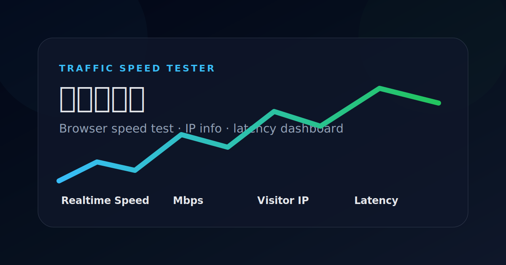

# Traffic Speed Tester / 流量测速器

一个以 **Vercel 部署为主** 的轻量浏览器测速面板，支持外部 CORS 可读源测速、自定义测速地址、实时速度 / Mbps / 流量统计、趋势图表、访客 IP 信息，以及国内 / 国外常用网站访问耗时探测。



> 在线 Demo：[https://tst.vsse.net/](https://tst.vsse.net/)
>
> 说明：GitHub README 会忽略链接的 `target="_blank"`，如需新标签页打开，请使用 Ctrl/⌘ + 点击或鼠标中键。

## 项目简介

Traffic Speed Tester 适合用于：

- 快速部署公开测速页面
- 临时测试浏览器侧下载速度
- 查看实时速度、Mbps 带宽和累计流量
- 查看访客公网 IP、归属地、运营商和 ASN
- 从访客浏览器侧估算国内 / 国外常用网站访问耗时

项目无需前端框架，核心由原生 HTML / CSS / JavaScript 与轻量 Node.js API 组成。

## 功能特性

- Vercel 优先：静态页面 + Serverless API
- 测试源选择：轻量本机测试包、外部 CORS 可读测试源、自定义地址
- 多线程测速：可设置 1-64 个并发下载线程
- 流量限制：支持 100MB、500MB、1GB、5GB、不限流量
- 实时指标：总流量、实时速度、Mbps 带宽、运行状态
- 实时图表：展示测速过程中的速率和延迟趋势
- 访客网络：展示访客 IP、归属地、运营商、ASN
- 网站延时：从访客浏览器侧探测国内 / 国外常用网站访问耗时
- Docker 兼容：仍保留自托管运行方式

## Vercel 部署

1. Fork 或导入本仓库到 GitHub。
2. 在 Vercel 新建项目，选择该仓库。
3. 使用默认配置即可：

```text
Framework Preset: Other
Build Command: npm run build
Output Directory: public
Install Command: npm install
```

仓库已包含 `vercel.json`：

```json
{
  "buildCommand": "npm run build",
  "outputDirectory": "public"
}
```

部署完成后即可访问测速页面。

## 测速源说明

当前本机源保留：

- 本机 1MB 测试包
- 本机 4MB 测试包

大流量测速建议使用：

- 外部 CORS 可读测试源
- 自定义测试文件地址
- 专门的对象存储 / CDN 静态测试文件

自定义地址需要允许浏览器跨域读取：

```http
Access-Control-Allow-Origin: *
```

或允许当前部署域名跨域访问。

## Docker 自托管部署

如果需要在自有服务器运行：

```bash
git clone <repo-url> traffic-speed-tester
cd traffic-speed-tester/deploy
docker compose up -d --build
```

默认访问：

```text
http://服务器IP:3303
```

默认端口映射：

```text
3303 -> 8080
```

## Node.js 本地运行

```bash
git clone <repo-url> traffic-speed-tester
cd traffic-speed-tester
npm install
npm start
```

默认访问：

```text
http://127.0.0.1:8080
```

## 开发与检查

```bash
npm run check
npm run build
```

## API 接口

- `GET /api/health`：健康检查
- `GET /api/ip`：访客 IP 信息
- `GET /api/links`：测速/拨测参考链接
- `GET /api/download?size=1m|4m`：轻量测试包，最大限制 4MB
- `POST /api/upload`：上传统计接口

Docker / Node 自托管额外保留：

- `GET /api/latency`：后端探测三大运营商站点延迟

## 项目结构

```text
.
├── api/                    # Vercel Serverless API
├── app/
│   ├── public/             # 页面、样式、前端脚本
│   ├── package.json        # Node 服务包配置
│   └── server.js           # Docker / Node 自托管服务
├── deploy/                 # Docker 部署文件
├── docs/                   # 产品、架构、实现说明
├── public/                 # Vercel 构建输出目录，部署时自动生成
├── scripts/                # 辅助脚本
├── package.json            # 仓库根 package
└── vercel.json             # Vercel 部署配置
```

## 许可证

MIT
